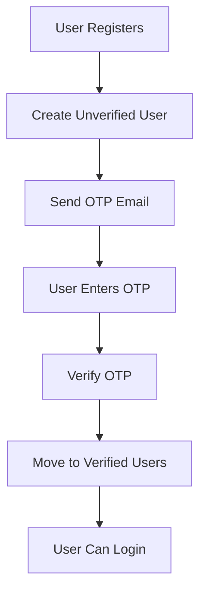

# 🔒 Secure Email Verification Flow

## Overview

This document describes the new secure email verification system that ensures users cannot access the application until they verify their email address.

## 🔐 Security Features

### 1. **No Database Entry Until Verification**
- Users are **NOT** added to the main `users` table during registration
- Instead, they are stored in a temporary `unverified_users` table
- Only after successful OTP verification are they moved to the main `users` table

### 2. **Email Verification Required for Login**
- Unverified users **CANNOT** log in
- NextAuth checks `email_verified` status before allowing authentication
- Prevents unauthorized access to the application

### 3. **Temporary Storage with Expiration**
- Unverified users are automatically cleaned up after 24 hours
- Prevents database bloat from abandoned registrations
- OTP codes expire after 10 minutes

## 📊 Database Schema

### `unverified_users` Table
```sql
CREATE TABLE unverified_users (
  id UUID PRIMARY KEY DEFAULT gen_random_uuid(),
  email VARCHAR(255) UNIQUE NOT NULL,
  password VARCHAR(255) NOT NULL,
  first_name VARCHAR(100) NOT NULL,
  last_name VARCHAR(100) NOT NULL,
  phone_number VARCHAR(20),
  city VARCHAR(100),
  country VARCHAR(100),
  created_at TIMESTAMP WITH TIME ZONE DEFAULT CURRENT_TIMESTAMP
);
```

### `users` Table (Existing)
- Users only appear here **after** email verification
- `email_verified` field is always `true` for verified users

## 🔄 User Registration Flow



### Step-by-Step Process

1. **Registration** (`POST /api/auth/register`)
   - User submits registration form
   - **Creates entry in `unverified_users` table**
   - Sends OTP verification email
   - Returns `requiresVerification: true`

2. **OTP Verification** (`POST /api/auth/verify-otp`)
   - User enters 6-digit OTP code
   - System validates OTP against `unverified_users`
   - **Moves user from `unverified_users` to `users` table**
   - Sets `email_verified = true`

3. **Login** (`POST /api/auth/[...nextauth]`)
   - User attempts to log in
   - NextAuth checks if user exists in `users` table
   - **Verifies `email_verified = true`**
   - Allows/denies access accordingly

## 🚀 API Endpoints

### Registration
```typescript
POST /api/auth/register
Body: { email, password, firstName, lastName, phoneNumber?, city?, country? }
Response: { message, tempUserId, requiresVerification: true }
```

### Send OTP
```typescript
POST /api/auth/send-otp
Body: { email }
Response: { message, email }
```

### Verify OTP
```typescript
POST /api/auth/verify-otp
Body: { email, otpCode }
Response: { message, user, success: true }
```

### Cleanup (Automated)
```typescript
POST /api/auth/cleanup-expired-tokens
Response: { message: "Cleanup completed successfully" }
```

## 🛡️ Security Measures

### Rate Limiting
- OTP sending is rate-limited to prevent abuse
- Uses `forgotPasswordRateLimit` (same as password reset)

### OTP Security
- 6-digit numeric codes
- 10-minute expiration
- Single-use (marked as used after verification)
- Unique per user/email combination

### Data Protection
- Passwords are hashed before storage
- Unverified users are isolated from main system
- Automatic cleanup prevents data accumulation

## 🔧 Implementation Details

### Database Functions
- `createUnverifiedUser()` - Creates temporary user entry
- `getUnverifiedUserByEmail()` - Retrieves unverified user
- `moveUnverifiedUserToVerified()` - Transfers user to main table
- `cleanupExpiredUnverifiedUsers()` - Removes old entries

### Authentication Flow
- NextAuth `authorize` callback checks `email_verified`
- Unverified users are rejected with clear error message
- Verified users proceed with normal authentication

### Error Handling
- Clear error messages for each failure scenario
- Graceful fallbacks for email delivery issues
- Comprehensive logging for debugging

## 🧹 Maintenance

### Automated Cleanup
The system automatically cleans up:
- Expired OTP codes (older than 10 minutes)
- Expired password reset tokens
- Unverified users (older than 24 hours)

### Manual Cleanup
```sql
-- Check unverified users
SELECT * FROM unverified_users;

-- Check OTP status
SELECT * FROM email_verification_otps;

-- Force cleanup (if needed)
DELETE FROM unverified_users WHERE created_at < NOW() - INTERVAL '24 hours';
```

## 🚨 Troubleshooting

### Common Issues

1. **"No pending verification found"**
   - User may have already verified
   - Check if user exists in `users` table
   - Verify email address spelling

2. **"Invalid or expired OTP"**
   - OTP may have expired (10 minutes)
   - User may have used wrong code
   - Check OTP table for status

3. **"User not found" during login**
   - User may not have verified email
   - Check `unverified_users` table
   - Verify registration completion

### Debug Commands
```sql
-- Check user verification status
SELECT id, email, email_verified FROM users WHERE email = 'user@example.com';

-- Check unverified users
SELECT * FROM unverified_users WHERE email = 'user@example.com';

-- Check OTP status
SELECT * FROM email_verification_otps WHERE email = 'user@example.com';
```

## ✅ Benefits

1. **Enhanced Security** - No unauthorized access possible
2. **Data Integrity** - Only verified users in main system
3. **User Experience** - Clear verification flow
4. **System Reliability** - Automatic cleanup prevents issues
5. **Compliance** - Meets email verification requirements

## 🔮 Future Enhancements

- Email verification reminders
- Multiple OTP attempts tracking
- Account recovery for abandoned verifications
- Integration with email service analytics
- Customizable verification timeouts
